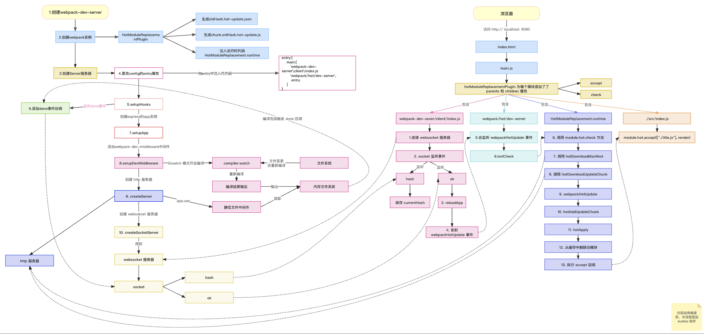

## 热更新原理



webpack hmr 是由 webpack-dev-server 这个库来做的。 webpack-dev-server 是一个基于 Express 的开发服务器，提供了一个用于开发环境的实时重载和热模块替换的解决方案。

工作原理如下：

1.  Webpack-dev-server 启动
    - 启动`webpack`，生成`compiler`实例。`compiler`上有很多方法，比如可以启动 `webpack` 所有**编译**工作，以及**监听**本地文件的变化。
    - 使用`express`框架启动本地`server`，让浏览器可以请求本地的**静态资源**。
    - 本地`server`启动之后，再去启动`websocket`服务，通过`websocket`，可以建立本地服务和浏览器的双向通信。这样就可以实现当本地文件发生变化，立马告知浏览器可以热更新代码。

2. 监听webpack 编译结束
    监听到编译结束，通过 websocket 给浏览器发送 ok 和 hash 事件。浏览器拿到最新 hash 值了，可以做检查更新。

3. 编译的开始说明监听到了代码的修改。这里靠 `webpack-dev-middleware `这个库来实现。`webpack-dev-server`只负责启动服务和前置准备工作，所有文件相关的操作都抽离到`webpack-dev-middleware`库了，主要是本地文件的**编译**和**输出**以及**监听**。
    - 调用了`compiler.watch`方法，监听本地文件的变化主要是通过**文件的生成时间**是否有变化。
    - 执行`setFs`方法，这个方法主要目的就是将编译后的文件打包到内存。这就是为什么在开发的过程中，你会发现`dist`目录没有打包后的代码，因为都在内存中。原因就在于访问内存中的代码比访问文件系统中的文件更快，而且也减少了代码写入文件的开销，这一切都归功于`memory-fs`。(my-hmr 中放在硬盘中，方便查看输出的文件)

4. 一次编译结束后，浏览器收到了`hash`和`ok`事件，hash 保存下来，ok 调用 webpackHotUpdate，webpackHotUpdate 最终调用模块中的 module.hot.check 方法，该方法由 hotModuleReplacementPlugin 注入。

5. 开始热更新
    - 利用上一次保存的`hash`值，调用`hotDownloadManifest`发送`xxx/hash.hot-update.json`的`ajax`请求；

    - 请求结果获取热更新模块，以及下次热更新的`Hash` 标识，并进入热更新准备阶段。

    - 调用`hotDownloadUpdateChunk`，通过`JSONP`方式发送`xxx/hash.hot-update.js` 请求。拿到最新代码。

    - 删除过期的模块，就是需要替换的模块

    - 将新的模块添加到 modules 中

    - 通过__webpack_require__执行相关模块的代码


```
hotModuleReplacementPlugin 插件将热更新的主要逻辑注入到 chunk 中，比如说拉取 js，执行，accept 回调。（dist/hmr.js 文件可以看作为 main.js 编译后被 hotModuleReplacementPlugin 注入之后的代码）
    它会在内存中生成两个补丁文件
    chunkId.lastHash.hot-update.json 说明上次编译到现在哪些代码块发生改变
    chunkId.lastHash.hot-update.js 存放着此代码块最新的模块定义，里面会调用 webpackHotUpdate 方法
```
